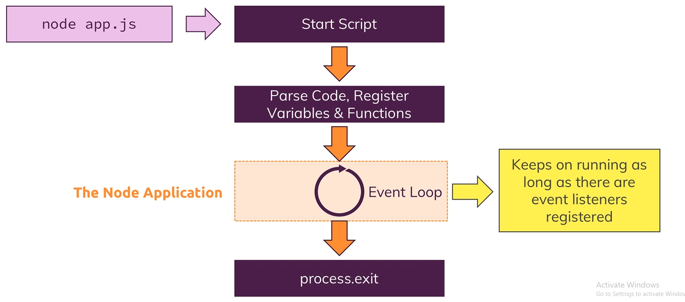
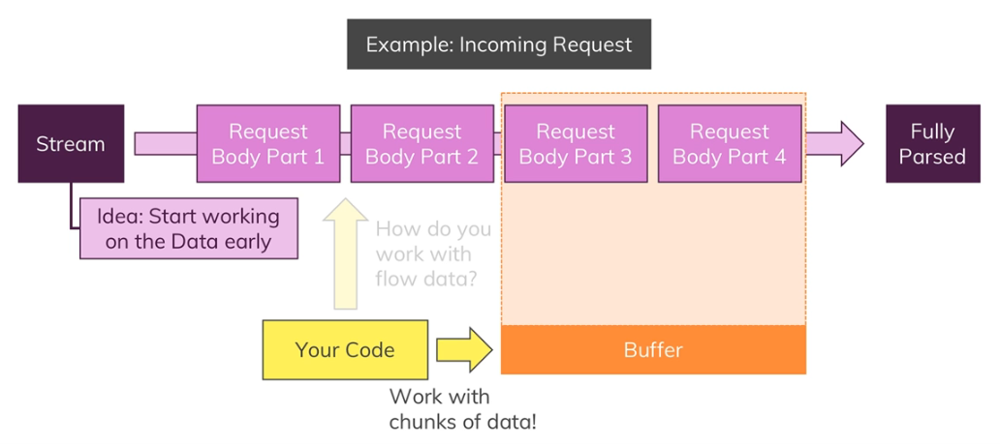

How does the web work ? & creating node.js server & using node core modules & working with requests and responses & Async code and event loop

# Creating Node Server

The way we import modules in Node.js is using require.

```js
// below lines create a server and server will be ready to listen at port 8080

const http = require('http'); // this will look for global module as we have not provided ./

const server = http.createServer((req, res) => {
    console.log(req);
});

server.listen(8080);

```
## Node Lifecycle



--------------------------------
Check [this](../takeInputStoreInFile.js) code where we are taking input from user and storing the provided input in a file.

req.on() will take two arguments. 1. the event on which the 2. argument call back function will be executed.
req.on('data', (chunk: any) => {}) --> the call back function will be executed when we have chunk of data available in req.




req.on('end', () => {}) --> the call back function will be executed when request is fully parsed.

> The order of code execution: Node will register the events like (createServer call back, req.on() call back) and they will not be executed synchronously, but when the event occurs (such as request is fully parsed) the call back function will be executed.

So in [example](../takeInputStoreInFile.js) if we should send the response after the request is fully parsed and file is written as shown below.

```js
const http = require('http');
const fs = require('fs');

const server = http.createServer((req, res) => {
    if(req.url === '/') {
        res.write('<html>');
        res.write('<head><title>Take input write in file</title></head>');
        res.write('<body><form action="/message" method="POST"><input type="text" name="msg"/><button type="submit">Send</button></form></body>');
        res.write('</html>');
        res.end();
        return;
    } else if( req.url === '/message' && req.method === 'POST') {
        const body = [];
        req.on('data', (chunk) => {
            body.push(chuck);
        });

        req.on('end', () => {
            const parsedBody = Buffer.concat(body).toString();
            const message = parsedBody.split('=')[1];
            fs.writeFileSync('inputFile.txt', message);
                    res.write('<html>');
        res.write('<head><title>Take input write in file</title></head>');
        res.write('<body>File with content is saved successfully</body>');
        res.write('</html>');
        res.end();
        });
    }
});

server.listen(3000);
```

> writeFileSync() is synchronous task means after execution will stop until the file is written. If we have huge file content then other requests will have to wait. Better to use writeFile() which is async and takes third argument as call back executed when the writing file is finished.


 