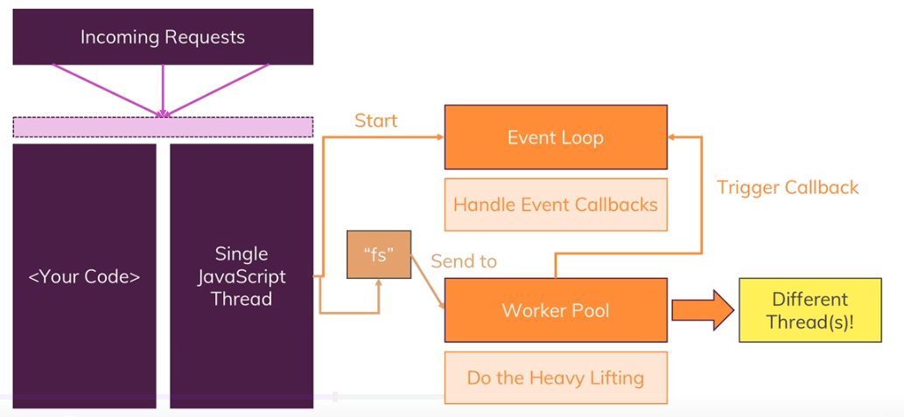
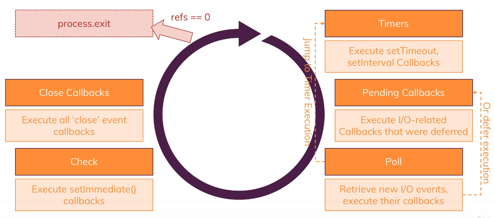
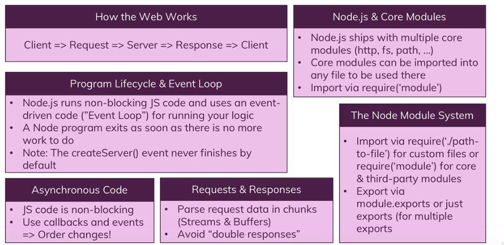

# Single Thread, Event loop & Blocking Code



https://www.geeksforgeeks.org/node-js-event-loop/



1. Timers:  This phase processes timers that have been set using setTimeout() and setInterval().
2. Pending Callbacks: This phase processes any callbacks that have been added to the message queue by asynchronous functions.
3. Idle, Prepare: The “idle.ignore” phase is not a standard phase of the event loop in Node.js. It means it’s Used internally only. The “idle” phase is a period of time during which the event loop has nothing to do and can be used to perform background tasks, such as running garbage collection or checking for low-priority events.
    > “idle.ignore” is not an official phase of the event loop, it is a way to ignore the idle phase, meaning that it will not use the time of the idle phase to perform background tasks.
    ```js
    const { idle } = require('idle-gc');
    idle.ignore();
    ```
4. Poll: This phase is used to check for new I/O events and process any that have been detected.
5. Check: This phase processes any setImmediate() callbacks that have been added to the message queue.
6. Close Callbacks: This phase processes any callbacks that have been added to the message queue by the close event of a socket. This means that any code that needs to be executed when a socket is closed is placed in the message queue and processed during this phase.

> If there are no open listeners (call back that are registered) in event loop, process.exit will be executed

```js
console.log("start");
setImmediate(() => {
    console.log("setImmediate");
});

setTimeout(() => {
    console.log("setTimeout");
}, 0)
console.log("end");
```
Output: 

start
setTimeout
setImmediate
end

> As Timer phase will come first, even though first setImmediate is written first in code we will see **setTimeout** first in output and then **setImmediate**

------------------
## Guess the output
```js
let fs = require('fs');
console.log("start");

const readStream = fs.createReadStream('./inputFile.txt');
readStream.on('data', (chunk) => {
    console.log("fileRead: ",chunk.toString());
    setImmediate(() => {
        console.log("setImmediate2");
    });
    fs.readFile('./inputFile.txt', (err, dataBuffer) => {
        console.log("readFile", dataBuffer)
    })
    setTimeout(() => {
        console.log("setTimeout2");
    }, 0);
})

setImmediate(() => {
    console.log("setImmediate");
});

setTimeout(() => {
    console.log("setTimeout");
}, 0)
console.log("end");
```

Output: 
>   start<br>
    end<br>
    setTimeout<br>
    setImmediate<br>
    fileRead:  ASDF<br>
    setImmediate2<br>
    setTimeout2<br>
    readFile <Buffer 41 53 44 46><br>

Explanation:
1. First iteration of Lifecycle:

    1> execute the code synchronously.

    2> console.log("start"); // start

    3> readStream - I/O operation put in poll phase

    4> setImmediate - put in pending callbacks phase

    5> setTimeout - put in Timers phase

    6> console.log("end"); // end

    7> Timers phase will come first - check if any callbacks in message queue for timers
    
    --> There is callback in queue from line no 5 so execute that callback // setTimeout

    8> Pending callbacks phase

    --> There is setImmediate call from line no 4 so execute that callback // setImmediate

    9> I/O phase

    --> There is readStream I/O operation form line no 3 // fileRead:  ASDF

    ---> Inside readStream callback we have some async code. that will be moved to message queue like this: 

    ----> 1> setImmediate - put in pending callbacks phase
    ----> 2> readFile - I/O operation put in poll phase
    ----> 3> setTimeout - put in Timers 
    
    10> Check - check for any pending callbacks

    --> We have one from line no 9--->1 - so that callback will be executed // setImmediate2

    11> Close callbacks: no close callbacks.

2. Second iteration of LifeCycle:

    1> Timers phase - line no 9--->3 from first iteration will be executed // setTimeout2

    2> I/O phase - read file from line no 9--->2 callback will be executed // readFile <Buffer 41 53 44 46>

------------------
## Summary 


    
